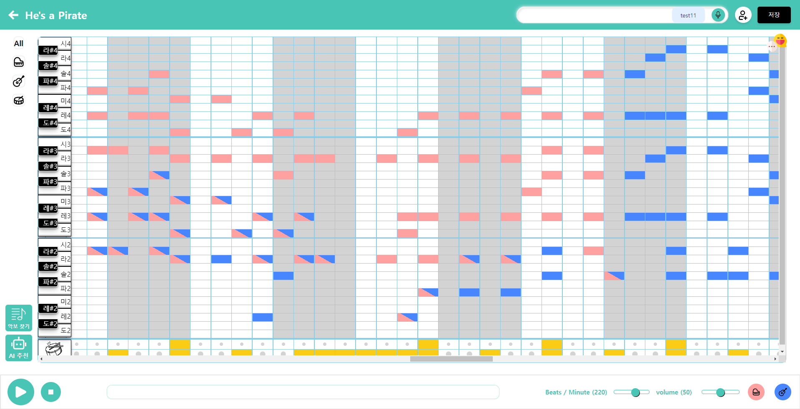

# Let’s note

|                                                              |                                                                                     |
| ------------------------------------------------------------ | ----------------------------------------------------------------------------------- |
| {: width="100" height="100"} | {: width="100" height="100"} |

## 서비스 소개

**Let’s Note**는 누구나 음악을 쉽고 재미있게 play 할 수 있도록 하는 악기 연주 플랫폼 입니다.

함께하고 싶은 친구들을 나의 작업실에 초대하고, 음성 채팅과 커서 공유를 통해 소통하세요. 그리고 여러 가상악기로 이루어진 우리만의 음악을 만들어보세요!

---

## 프로젝트 실행 방법

### 프론트엔드

```bash
$ git clone [https://github.com/Team-SoundHub/Let-s-Note.git](https://github.com/Team-SoundHub/Let-s-Note.git)
$ cd Let-s-Note/frontend
```

### 환경변수 설정

```bash
vim .env
```

- .env 파일에 해당 변수들을 알맞게 선언합니다

```bash
REACT_APP_GOOGLE_CX = {구글 CSE CX 값}
REACT_APP_GOOGLE_API_KEY = {구글 CSE 키}
REACT_APP_BACKEND_URL = {백엔드 API URL}
REACT_APP_BACKEND_URL = {백엔드 API URL}
REACT_APP_SOCKET_URL =  {웹 소켓 주소}
REACT_APP_SOCKET_HTTP = {백엔드 서버 https 주소}
REACT_APP_TURN_SERVER = {TURN 서버 주소}
```

### 실행

```bash
$ cd src
$ npm install && npm start
```

## 백엔드

```bash
$ git clone [https://github.com/Team-SoundHub/Let-s-Note.git](https://github.com/Team-SoundHub/Let-s-Note.git)

$ cd Let-s-Note/backend/letsnote/src/main/resource/static
```

### properties 파일 설정

```bash
$ vim application.yml
```

아래 내용을 참고하여 중괄호 안의 내용을 채운다.

```yaml
spring:
  datasource:
    driver-class-name: com.mysql.cj.jdbc.Driver
    url: jdbc:mysql://{DB서버 주소}/{DB 이름}?autoReconnect=true&useUnicode=true&characterEncoding=utf8&useSSL=false&requireSSL=false&serverTimezone=Asia/Seoul&allowMultiQueries=true
    username: { 아이디 }
    password: { 비밀번호 }
  jpa:
    show-sql: true
    hibernate:
      ddl-auto: update
    properties:
      hibernate:
        format_sql: true
        show_sql: true
jwt:
  header: Authorization
  secret: { refreshToken과는 다른 HS512형식의 시크릿 키 }
  refresh-token-secret: { accessToken과는 다른 HS512형식의 시크릿 키 }
  access-token-validity-in-seconds: 3600
  refresh-token-validity-in-seconds: 86400
letsnote:
  baseUrl: { 백엔드 서버 주소 }
ai-server:
  baseUrl: { 모델 서버 주소 }
```

### 실행

```bash
$ ./gradlew build

$ java -jar build/libs/letsnote.jar
```

---

## 기능 소개

1. 가상악기 연주 및 작업물 저장
   - 가로축은 박자 , 세로축은 음계로 배치하여 격자에 해당하는 음을 진행하는 방식
   - Tone.js 를 활용하여 피아노, 기타, 드럼 악기 음원 출력 및 음질 조정
   - 완성된 음악을 저장해 나의 작품으로 남기고, 피드에 공유하는 기능
2. 악보 검색 & 보관 기능
   - 악보 검색에 최적화시킨 Google Custom Search Engine으로 악보 이미지 제공
   - API를 통해 받아온 이미지를 저장하는 이미지 보관 기능
3. 동시 편집 기능

   1. 웹소켓 기반 작업 내용 공유

   - 실시간으로 작업실의 음표 노트 정보, 커서 위치, 채팅 공유

   1. WebRTC 기반 음성채팅 기능
      |1. Signaling|2. P2P Connection|
      |--|--|
      |||

   - P2P Mesh 방식을 활용하여 다중 음성채팅 활성화
   - 웹소켓을 통해 연결 후보 Signal 교환

4. 드럼 루프 자동 생성

   - 일부 드럼 비트 입력 후 드럼 클릭 시 자동 완성

   

5. AI 노트 추천 기능

   - GPT 3.5 Assistant 기반 GPT API 공식 문서에 소개된 프롬프트 엔지니어링 방법론을 활용하여 도메인 지식을 주입하고, 응답 형식 정확도를 올리기 위해 입, 출력 형식을 프롬프트로 조정

   

---

## 기술적 챌린지

1. 음질 개선
   |{: width="40" height="20"}|{: width="40" height="20"}|
   |--|--|
   |||

2. 웹 소켓 지연 개선

   | {: width="40" height="20"}                 | {: width="40" height="20"}                    |
   | ------------------------------------------------------------------------------ | --------------------------------------------------------------------------------- |
   | - 노트 정보가 server → DB → server → Client순으로 동기적 전달- 지연시간: 0.18s | - DB에서 server, client에게 비동기적으로 정보를 전달하도록 변경 - 지연시간: 0.04s |

3. 노트 중복 생성 문제

   

   - 여러 사용자가 하나의 노트에 대해 접근 시 동기화 문제 발생

   

   - DB 노트 정보 접근 시 세마포어를 도입하여 동기화 보장

4. 마우스 위치 공유시 과도한 소켓 요청 문제

   

   - mousemove 이벤트 기반
   - 8ms 마다 요청(125회/s)
     소켓 서버 부하

   

   - 스로틀링, 디바운싱 활용
   - 최대 요청 빈도 제한(5회/s)
   - 불필요한 요청 제거

   

   - 소켓 서버 부하를 줄여 즉각적인 반응 유지
   - 협업 관련 사용자 경험 개선

5. 웹 소켓 보안 계층 추가


- Stomp 프로토콜을 활용하여 메세지들을 브로드캐스팅 할 수 있도록 구현
- 인가되지 않은 사용자가 소켓 연결 메세지를 보내도 인증 절차의 부재로 보안 문제 발생


- 특정 유저가 메세지 브로커에 웹소켓 연결 요청 시, JWT 토큰을 파싱하여
- 해당 유저가 음악 작업실의 멤버인지 판단하는 인증 인터셉터 계층 추가


- 웹소켓 연결 시 엑세스 토큰으로 유저의 인가 여부를 판단
- 인가되지 않은 사용자는 웹소켓 연결을 거부하여 보안을 강화

---

## 아키텍쳐


---

## Dependency

```jsx
frontend@0.1.0
├── @babel/runtime@7.23.9
├── @reduxjs/toolkit@2.1.0
├── @stomp/stompjs@7.0.0
├── @tailwindcss/forms@0.5.7
├── @testing-library/jest-dom@5.17.0
├── @testing-library/react@13.4.0
├── @testing-library/user-event@13.5.0
├── autoprefixer@10.4.17
├── axios@1.6.7
├── dom-helpers@5.2.1 extraneous
├── flowbite-react@0.7.2
├── flowbite@2.2.1
├── postcss@8.4.33
├── process@^0.11.10
├── react-dom@18.2.0
├── react-redux@9.1.0
├── react-router-dom@6.21.3
├── react-scripts@5.0.1
├── react-transition-group@4.4.5 extraneous
├── react-webcam@^7.2.0
├── react@18.2.0
├── simple-peer@^9.11.1
├── socket.io-client@4.7.4
├── sockjs-client@1.6.1
├── sockjs@0.3.24
├── soundfont2@0.4.0
├── styled-components@6.1.8
├── sweetalert2@11.10.5
├── tailwind-styled-components@2.2.0
├── tailwindcss@3.4.1
├── tone@14.7.77
├── web-vitals@2.1.4
├── webmidi@3.1.8
└── websocket@1.0.34
```
